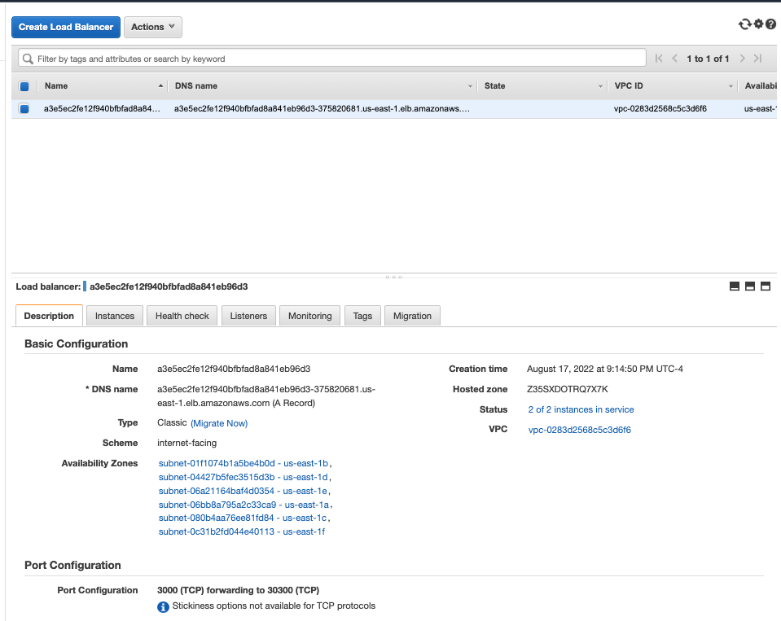
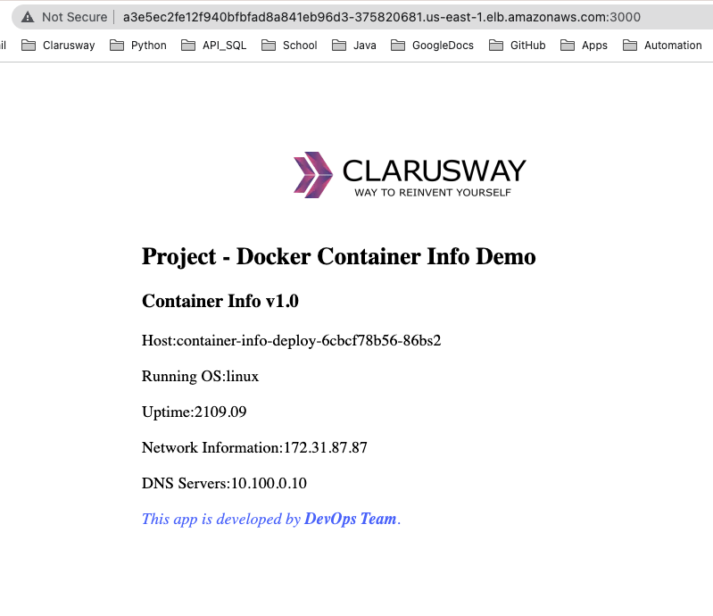

# Hands-on EKS-01 : Creating and Managing Kubernetes Cluster with AWS EKS

Purpose of this hands-on training is to give students the knowledge of how to use AWS Elastic Kubernetes Service


## Learning Outcomes

At the end of this hands-on training, students will be able to;

- Learn to Create and Manage EKS Cluster with Worker Nodes

## Outline

- Part 1 - Creating the Kubernetes Cluster on EKS

- Part 2 - Creating a kubeconfig file

- Part 3 - Adding Worker Nodes to the Cluster

- Part 4 - Configuring Cluster Autoscaler

- Part 5 - Deploying a Sample Application

## Prerequisites

- Launch an AWS EC2 instance of Amazon Linux 2 AMI with security group allowing SSH.

- Connect to the instance with SSH.

- Update the installed packages and package cache on your instance.

```bash
sudo yum update -y
```

- Download the Amazon EKS vended kubectl binary.

```bash
curl -o kubectl https://s3.us-west-2.amazonaws.com/amazon-eks/1.22.6/2022-03-09/bin/linux/amd64/kubectl
```

- Apply execute permissions to the binary.

```bash
chmod +x ./kubectl
```

- Copy the binary to a folder in your PATH. If you have already installed a version of kubectl, then we recommend creating a $HOME/bin/kubectl and ensuring that $HOME/bin comes first in your $PATH.

```bash
mkdir -p $HOME/bin && cp ./kubectl $HOME/bin/kubectl && export PATH=$PATH:$HOME/bin
```

- (Optional) Add the $HOME/bin path to your shell initialization file so that it is configured when you open a shell.

```bash
echo 'export PATH=$PATH:$HOME/bin' >> ~/.bashrc
```

- After you install kubectl , you can verify its version with the following command:

```bash
kubectl version --short --client
```

- Configure AWS credentials. Or you can attach `AWS IAM Role` to your EC2 instance.

```bash
aws configure
```

- aws configuration

```bash
$ aws configure
  AWS Access Key ID [None]: xxxxxxx
  AWS Secret Access Key [None]: xxxxxxxx
  Default region name [None]: us-east-1
  Default output format [None]: json
```

- Verify that you can see your cluster listed, when authenticated

```bash
$ aws eks list-clusters
{
  "clusters": []
}
```

## Part 1 - Creating the Kubernetes Cluster on EKS

1. Direct the students to AWS EKS Service webpage. 

2. Give general description about the page and *****the pricing***** of the services.

- https://aws.amazon.com/eks/pricing/

3. Select ```Cluster``` on the left-hand menu and click on "Create cluster" button. You will be directed to the ```Configure cluster``` page:

    - Give general descriptions about the page and the steps of creating the cluster.

    - Fill the ```Name``` and ```Kubernetes version``` fields. (Ex: MyCluster, 1.21)

        <i>Mention the durations for minor version support and the approximate release frequency.</i>

    - On the ```Cluster Service Role``` field; give general description about why we need this role. 

    - Create EKS Cluster Role with ```EKS - Cluster``` use case and ```AmazonEKSClusterPolicy```.
                
        - EKS Cluster Role :                                                                                              
           - use case   :  ```EKS - Cluster``` 
           - permissions: ```AmazonEKSClusterPolicy```.

    - Select the recently created role, back on the ```Cluster Service Role``` field.

    - Proceed to the ```Secrets Encryption``` field. 
    
    - Activate the field, give general description about ```KMS Service``` and describe where we use those keys and give an example about a possible key.

    - Deactivate back the ```Secrets Encryption``` field and keep it as is.

    - Proceed to the next step (Specify Networking).

4. On the ```Specify Networking``` page's ```Networking field```:

    - Select the default VPC and all public subnets.

        <i>Explain the necessity of using dedicated VPC for the cluster.</i>

    - Select default VPC security or create one with SSH connection and https. 

        <i>Explain the necessity of using dedicated Securitygroup for the cluster.</i>

    - Proceed to ```Cluster Endpoint Access``` field.

    - Give general description about the options on the field.

    - Explain ```Advanced Settings```.

    - Select ```Public and Private``` option on the field.

    - Proceed to the next step (Configure Logging).

5. On the ```Configure Logging``` page:

    - Give general descriptions about the logging options.

    - Proceed to the final step (Review and create).

6. On the ```Review and create``` page:

    - Create the cluster.


## Part 2 - Creating a kubeconfig file

1. Give general descriptions about what ```config file``` is.

2. Verify that you can see your cluster listed, when authenticated

```bash
$ aws eks list-clusters
{
  "clusters": [
    "my-cluster"
  ]
}
```

3. Show the content of the $HOME directory including hidden files and folders. If there is a ```.kube``` directory, show what it has inside.  

4. Run the command
```bash
aws eks --region <us-east-1> update-kubeconfig --name <cluster_name>
``` 

5. Explain what the above command does.

6. Then run the command on your terminal
```bash
kubectl get svc
```
You should see the output below
```bash
NAME             TYPE        CLUSTER-IP   EXTERNAL-IP   PORT(S)   AGE
svc/kubernetes   ClusterIP   10.100.0.1   <none>        443/TCP   1m
```
7. Run the command below to show that there is no node for now.
```bash
kubectl get node
```
8. Show again the content of the $HOME directory including hidden files and folders. Find the ```config``` file inside ```.kube``` directory. Then show the content of the file.


## Part 3 - Adding Worker Nodes to the Cluster

1. Get to the cluster page that is recently created.

2. Wait until seeing the ```ACTIVE``` status for the cluster.

```bash
$ aws eks describe-cluster --name <cluster-name> --query cluster.status
  "ACTIVE"
```

3. On the cluster page, click on ```Compute``` tab and ```Add Node Group``` button.

4. On the ```Configure node group``` page:

    - Give a unique name for the managed node group.

    - For the node's IAM Role, get to IAM console and create a new role with ```EC2 - Common``` use case having the policies of ```AmazonEKSWorkerNodePolicy, AmazonEC2ContainerRegistryReadOnly, AmazonEKS_CNI_Policy```.
    
        - ```Use case:    EC2 ```
        - ```Policies: AmazonEKSWorkerNodePolicy, AmazonEC2ContainerRegistryReadOnly, AmazonEKS_CNI_Policy```
    
        <i>Give a short description about why we need these policies.</i>
        <i>Explain the necessity of using dedicated IAM Role.</i>

    -  Proceed to the next page.

5. On the ```Set compute and scaling configuration``` page:
 
    - Choose the appropriate AMI type for Non-GPU instances. (Amazon Linux 2 (AL2_x86_64))

    - Choose ```t3.medium``` as the instance type.

        <i>Explain why we can't use</i> ```t2.micro```.
    - Choose appropriate options for other fields. (3 nodes are enough for maximum, 2 nodes for minimum and desired sizes.)

    - Proceed to the next step.

6. On the ```Specify networking``` page:

    - Choose the subnets to launch your nodes.
    
    - Allow remote access to your nodes.
    <i>Mention that if we don't allow remote access, it's not possible to enable it after the node group is created.</i>
    
    - Select your SSH Key to for the connection to your nodes.
    
    - You can also limit the IPs for the connection.

    - Proceed to the next step. Review and create the ```Node Group```.

7. Run the command below on your local.
```bash
kubectl get nodes --watch
```

8. Show the EC2 instances newly created.


## Part 4 - Configuring Cluster Autoscaler

1. Explain what ```Cluster Autoscaler``` is and why we need it.

2. Create a policy with following content. You can name it as ClusterAutoscalerPolicy. 
```json
{
    "Version": "2012-10-17",
    "Statement": [
        {
            "Action": [
                "autoscaling:DescribeAutoScalingGroups",
                "autoscaling:DescribeAutoScalingInstances",
                "autoscaling:DescribeLaunchConfigurations",
                "autoscaling:DescribeTags",
                "autoscaling:SetDesiredCapacity",
                "autoscaling:TerminateInstanceInAutoScalingGroup",
                "ec2:DescribeLaunchTemplateVersions"
            ],
            "Resource": "*",
            "Effect": "Allow"
        }
    ]
}
```

3. Attach this policy to the IAM Worker Node Role which is already in use.

4. Deploy the ```Cluster Autoscaler``` with the following command.
```bash
kubectl apply -f https://raw.githubusercontent.com/kubernetes/autoscaler/master/cluster-autoscaler/cloudprovider/aws/examples/cluster-autoscaler-autodiscover.yaml
```

5. Add an annotation to the deployment with the following command.
```bash
kubectl -n kube-system annotate deployment.apps/cluster-autoscaler cluster-autoscaler.kubernetes.io/safe-to-evict="false"
```

6. Edit the Cluster Autoscaler deployment with the following command.
```bash
kubectl -n kube-system edit deployment.apps/cluster-autoscaler
```
This command will open the yaml file for your editting. Replace <CLUSTER NAME> value with your own cluster name, and add the following command option ```--skip-nodes-with-system-pods=false``` to the command section under ```containers``` under ```spec```. Save and exit the file by pressing ```:wq```. The changes will be applied.

7. Find an appropriate version of your cluster autoscaler in the [link](https://github.com/kubernetes/autoscaler/releases). The version number should start with version number of the cluster Kubernetes version. For example, if you have selected the Kubernetes version 1.19, you should find something like ```1.19.6```.

8. Then, in the following command, set the Cluster Autoscaler image tag as that version you have found in the previous step.
```bash
kubectl -n kube-system set image deployment.apps/cluster-autoscaler cluster-autoscaler=us.gcr.io/k8s-artifacts-prod/autoscaling/cluster-autoscaler:<YOUR-VERSION-HERE>
```
You can also replace ```us``` with ```asia``` or ```eu```.


## Part 5 - Deploying a Sample Application


1. Create a .yml file in your local environment with the following content.

```yaml
kind: Namespace
apiVersion: v1
metadata:
   name: my-namespace
   labels:
      app: container-info
---
apiVersion: v1
kind: Service
metadata:
   name: container-info-svc
   namespace: my-namespace
   labels:
      app: container-info
spec:
   type: LoadBalancer
   ports:
      - protocol: TCP
        port: 3000
        nodePort: 30300
        targetPort: 80
   selector:
      app: container-info
--- 
apiVersion: apps/v1
kind: Deployment
metadata:
  name: container-info-deploy
  namespace: my-namespace
  labels:
    app: container-info
spec:
  replicas: 3
  selector:
    matchLabels:
      app: container-info
  template:
    metadata:
      labels:
        app: container-info
    spec:
      containers:
      - name: container-info
        image: clarusway/container-info:1.0
        ports:
        - containerPort: 80
```

2. Deploy the application with following command.
```bash
kubectl apply -f <your-sample-app>.yaml
```

3. Run the command below.
```bash
kubectl -n my-namespace get svc
```

4. In case the service remains in pending state then analyze it. 

```bash
kubectl describe service container-info-svc -n my-namespace
```
Show the warning: "Error creating load balancer (will retry): failed to ensure load balancer for service default/guestbook: could not find any suitable subnets for creating the ELB"

5. Go to this [link](https://aws.amazon.com/tr/premiumsupport/knowledge-center/eks-vpc-subnet-discovery/). Explain that it is necessary to tag selected subnets as follows:

- Key: kubernetes.io/cluster/<cluster-name>
- Value: shared

6. Go to the VPC service on AWS console and select "subnets". On the ```Subnets``` page select "Tags" tab and add this tag:

- Key: kubernetes.io/cluster/<cluster-name>
- Value: shared


7. Describe service object and analyze it.

```bash
kubectl describe service container-info-svc -n my-namespace
```

8. Get the ```External IP``` value from the previous command's output and visit that ip.
   

9. For scale up edit deployment. Change "replicas=30" in .yaml file. Save the file.

```bash
kubectl edit deploy container-info-deploy -n my-namespace
```
10. Watch the pods while creating. Show that some pods are pending state.
```bash
kubectl get po -n my-namespace -w
```
11. Describe one of the pending pods. Show that there is no resource to run pods. So cluster-autoscaler scales out and create one more node.

```bash
kubectl describe pod container-info-deploy-xxxxxx -n my-namespace
kubectl get nodes
```

12. Atfer clean-up `worker nodes` and `cluster`, delete the `LoadBalancer` manually.
