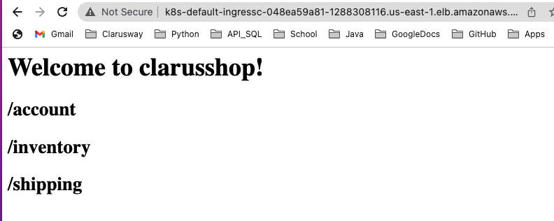
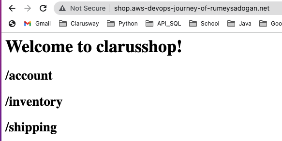
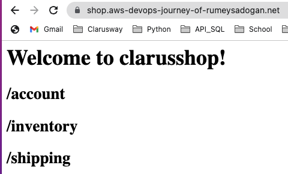

# Hands-on EKS-ALB : AWS LoadBalancer Controller (ALB) and Ingress with EKS

Purpose of the this hands-on training is to give students the knowledge of AWS LoadBalancer Controller and Ingress with EKS.

## Learning Outcomes

At the end of the this hands-on training, students will be able to;

- Learn to Create and Manage EKS Cluster with eksctl.

- Understand the Ingress and AWS LoadBalancer Controller (ALB) Usage.

## Outline

- Part 1 - Installing kubectl and eksctl on Amazon Linux 2

- Part 2 - Creating the Kubernetes Cluster on EKS

- Part 3 - Ingress and AWS LoadBalancer Controller (ALB)

## Prerequisites

1. AWS CLI with Configured Credentials

2. kubectl installed

3. eksctl installed

For information on installing or upgrading eksctl, see [Installing or upgrading eksctl.](https://docs.aws.amazon.com/eks/latest/userguide/eksctl.html#installing-eksctl)

## Part 1 - Installing kubectl and eksctl on Amazon Linux 2

### Install git, helm and kubectl

- Launch an AWS EC2 instance of Amazon Linux 2 AMI (type t2.micro) with security group allowing SSH.

- Connect to the instance with SSH.

- Update the installed packages and package cache on your instance.

```bash
sudo yum update -y
```

- Install git.

```bash
sudo yum install git
```

- Install helm.
  > used below commands to install helm
  ```sh
  curl -fsSL -o get_helm.sh \
  https://raw.githubusercontent.com/helm/helm/master/scripts/get-helm-3
  chmod 700 get_helm.sh
  DESIRED_VERSION=v3.8.2 ./get_helm.sh
  helm version
  ```

```bash
curl -sSL https://raw.githubusercontent.com/helm/helm/master/scripts/get-helm-3 | bash
helm version --short
```

- Download the Amazon EKS vended kubectl binary.

```bash
curl -o kubectl https://s3.us-west-2.amazonaws.com/amazon-eks/1.22.6/2022-03-09/bin/linux/amd64/kubectl
```

- Apply execute permissions to the binary.

```bash
chmod +x ./kubectl
```

- Copy the binary to a folder in your PATH. If you have already installed a version of kubectl, then we recommend creating a $HOME/bin/kubectl and ensuring that $HOME/bin comes first in your $PATH.

```bash
mkdir -p $HOME/bin && cp ./kubectl $HOME/bin/kubectl && export PATH=$PATH:$HOME/bin
```

- (Optional) Add the $HOME/bin path to your shell initialization file so that it is configured when you open a shell.

```bash
echo 'export PATH=$PATH:$HOME/bin' >> ~/.bashrc
```

- After you install kubectl , you can verify its version with the following command:

```bash
kubectl version --short --client
```

### Install eksctl

- Download and extract the latest release of eksctl with the following command.

```bash
curl --silent --location "https://github.com/weaveworks/eksctl/releases/latest/download/eksctl_$(uname -s)_amd64.tar.gz" | tar xz -C /tmp
```

- Move the extracted binary to /usr/local/bin.

```bash
sudo mv /tmp/eksctl /usr/local/bin
```

- Test that your installation was successful with the following command.

```bash
eksctl version
```

## Part 2 - Creating the Kubernetes Cluster on EKS

- If needed create ssh-key with commnad `ssh-keygen -f ~/.ssh/id_rsa`

- Configure AWS credentials.

```bash
aws configure
```

- Create an EKS cluster via `eksctl`. It will take a while.

```bash

eksctl create cluster \
 --name mycluster \
 --version 1.22 \
 --region us-east-1 \
 --zones us-east-1a,us-east-1b,us-east-1c \
 --nodegroup-name my-nodes \
 --node-type t2.medium \
 --nodes 1 \
 --nodes-min 1 \
 --nodes-max 2 \
 --ssh-access \
 --ssh-public-key  ~/.ssh/id_rsa.pub \
 --managed

or 

eksctl create cluster --region us-east-1  --zones us-east-1a,us-east-1b,us-east-1c --node-type t2.medium --nodes 1 --nodes-min 1 --nodes-max 2 --name mycluster

```

- Note that the default value for node-type is m5.large.

```bash
$ eksctl create cluster --help
```

- Show the aws `eks service` on aws management console and explain `eksctl-mycluster-cluster` stack on `cloudformation service`.

## Part 3 - Ingress and AWS LoadBalancer Controller (ALB)

- Firstly, we deploy the AWS Load Balancer Controller to our Amazon EKS cluster according to [AWS Load Balancer Controller user guide](https://docs.aws.amazon.com/eks/latest/userguide/aws-load-balancer-controller.html)

- Download an IAM policy for the AWS Load Balancer Controller that allows it to make calls to AWS APIs on your behalf. 

```bash
curl -o iam_policy.json https://raw.githubusercontent.com/kubernetes-sigs/aws-load-balancer-controller/v2.4.1/docs/install/iam_policy.json
```

- Create an IAM policy using the policy downloaded in the previous step. 

```bash
aws iam create-policy \
    --policy-name AWSLoadBalancerControllerIAMPolicy \
    --policy-document file://iam_policy.json
```

- Create an IAM role. Create a Kubernetes service account named aws-load-balancer-controller in the kube-system namespace for the AWS Load Balancer Controller and annotate the Kubernetes service account with the name of the IAM role.
- Replace my-cluster with the name of your cluster, 111122223333 with your account ID, and then run the command.

```bash
eksctl create iamserviceaccount \
  --cluster=my-cluster \
  --namespace=kube-system \
  --name=aws-load-balancer-controller \
  --role-name "AmazonEKSLoadBalancerControllerRole" \
  --attach-policy-arn=arn:aws:iam::111122223333:policy/AWSLoadBalancerControllerIAMPolicy \
  --approve
```

- You will take an error like provided below:

```bash
2022-05-09 07:50:11 [ℹ]  eksctl version 0.96.0
2022-05-09 07:50:11 [ℹ]  using region us-east-2
2022-05-09 07:50:12 [!]  no IAM OIDC provider associated with cluster, try 'eksctl utils associate-iam-oidc-provider --region=us-east-1 --cluster=mycluster'
```

- Solution to this error provide the command below:

```bash
eksctl utils associate-iam-oidc-provider --region=us-east-1 --cluster=mycluster --approve
```

- You shoulD provide the last command again in order to create IAM service account:

```bash
eksctl create iamserviceaccount \
  --cluster=my-cluster \
  --namespace=kube-system \
  --name=aws-load-balancer-controller \
  --role-name "AmazonEKSLoadBalancerControllerRole" \
  --attach-policy-arn=arn:aws:iam::111122223333:policy/AWSLoadBalancerControllerIAMPolicy \
  --approve
```

  - Install the AWS Load Balancer Controller using Helm V3 or later or by applying a Kubernetes manifest.

```bash
helm repo add eks https://aws.github.io/eks-charts

helm repo update

helm install aws-load-balancer-controller eks/aws-load-balancer-controller \
  -n kube-system \
  --set clusterName=mycluster \
  --set serviceAccount.create=false \
  --set serviceAccount.name=aws-load-balancer-controller 
```

- Verify that the controller is installed.

```bash
kubectl get deployment -n kube-system aws-load-balancer-controller
```

Output:

```bash
NAME                           READY   UP-TO-DATE   AVAILABLE   AGE
aws-load-balancer-controller   2/2     2            2           84s
```

### Application

> Copy the k8s folder to ec2-instance with `scp command`.

```bash
scp -i <pem-file> -r <eks-03-AWS-EKS-ALB-ingress/k8s> ec2-user@<ec2-instance-public-ip>:~/k8s
```

The directory structure is as follows:

```bash
.
├── k8s
│   ├── account-deploy.yaml
│   ├── account-service.yaml
│   ├── inventory-deploy.yaml
│   ├── inventory-service.yaml
│   ├── shipping-deploy.yaml
│   ├── shipping-service.yaml
│   ├── storefront-deploy.yaml
│   └── storefront-service.yaml
```

- Let's check the state of the cluster and see that evertyhing works fine.

```bash
kubectl cluster-info
kubectl get node
```

- Create an `ingress.yaml` file.

```yaml
apiVersion: networking.k8s.io/v1
kind: Ingress
metadata:
  name: ingress-clarusshop
  annotations: 
    kubernetes.io/ingress.class: alb
    alb.ingress.kubernetes.io/scheme: internet-facing 

    # Health Check Settings
    alb.ingress.kubernetes.io/healthcheck-protocol: HTTP 
    alb.ingress.kubernetes.io/healthcheck-port: traffic-port
    alb.ingress.kubernetes.io/healthcheck-interval-seconds: '15' 
    alb.ingress.kubernetes.io/healthcheck-timeout-seconds: '5' 
    alb.ingress.kubernetes.io/success-codes: '200'
    alb.ingress.kubernetes.io/healthy-threshold-count: '2'
    alb.ingress.kubernetes.io/unhealthy-threshold-count: '2'

spec:
  rules:
    - http:
        paths:
          - path: /account
            pathType: Prefix
            backend:
              service:
                name: account-service
                port: 
                  number: 80
          - path: /inventory
            pathType: Prefix
            backend:
              service:
                name: inventory-service
                port:
                  number: 80
          - path: /shipping
            pathType: Prefix
            backend:
              service:
                name: shipping-service
                port:
                  number: 80
          - path: /
            pathType: Prefix
            backend:
              service:
                name: storefront-service
                port: 
                  number: 80
```

- Launch the aplication.

```bash
kubectl apply -f k8s
```

- List the ingress.

```bash
kubectl get ingress
```

Output:

```bash
NAME                 CLASS    HOSTS   ADDRESS                                                                 PORTS   AGE
ingress-clarusshop   <none>   *       k8s-default-ingressc-38a2e90a69-465630546.us-east-2.elb.amazonaws.com   80      89s
```

- On browser, type this  ( k8s-default-ingressc-38a2e90a69-465630546.us-east-2.elb.amazonaws.com ), you must see the clarusshop web page. If you type `k8s-default-ingressc-38a2e90a69-465630546.us-east-2.elb.amazonaws.com/account`, then the account page will be opened and so on.
  

>**Important Note: In order for Ingress to run smoothly, the paths specified in the application and the paths in ingress must be the same. For example, account microservice must be published from `/account` path.**

- As per our ingress manifest, ALB is forwarding request to different application by using paths (/, /account, /inventory, /shipping)
  


- We can create a CNAME record in our Hosted Zone by giving a subdomain name as `shop.<domain_name_of_hosted_zone>`, to reach our application from the desired dns name.



### Adding hostname and certificate to ALB.

- For now, our application is working on http. Now, we add an host name and return the http to https.

- Firstly, bind ingress address to an host name in the route53 service.

- Then update the ingress.yaml as below. Don't forgot to change certificate-arn.

```yaml
apiVersion: networking.k8s.io/v1
kind: Ingress
metadata:
  name: ingress-clarusshop
  annotations: 
    kubernetes.io/ingress.class: alb
    alb.ingress.kubernetes.io/scheme: internet-facing 

    # Health Check Settings
    alb.ingress.kubernetes.io/healthcheck-protocol: HTTP 
    alb.ingress.kubernetes.io/healthcheck-port: traffic-port
    alb.ingress.kubernetes.io/healthcheck-interval-seconds: '15' 
    alb.ingress.kubernetes.io/healthcheck-timeout-seconds: '5' 
    alb.ingress.kubernetes.io/success-codes: '200'
    alb.ingress.kubernetes.io/healthy-threshold-count: '2'
    alb.ingress.kubernetes.io/unhealthy-threshold-count: '2'
    # To use certificate add annotations below.
    alb.ingress.kubernetes.io/certificate-arn: arn:aws:acm:us-east-2:046402772087:certificate/dae75cd6-8d82-420c-bed1-1ea132ec3d37
    alb.ingress.kubernetes.io/listen-ports: '[{"HTTP": 80}, {"HTTPS":443}]'
    alb.ingress.kubernetes.io/ssl-redirect: '443'

spec:
  rules:
    - host: shop.clarusway.us
      http:
        paths:
          - path: /account
            pathType: Prefix
            backend:
              service:
                name: account-service
                port: 
                  number: 80
          - path: /inventory
            pathType: Prefix
            backend:
              service:
                name: inventory-service
                port:
                  number: 80
          - path: /shipping
            pathType: Prefix
            backend:
              service:
                name: shipping-service
                port:
                  number: 80
          - path: /
            pathType: Prefix
            backend:
              service:
                name: storefront-service
                port: 
                  number: 80
```

- Update the ingress.

```bash
kubectl apply -f ingress.yaml
```

- List the ingress.

```bash
kubectl get ingress
```

Output:

```bash
NAME                 CLASS    HOSTS                     ADDRESS                                                                  PORTS   AGE
ingress-clarusshop   <none>   clarusshop.clarusway.us   k8s-default-ingressc-38a2e90a69-1914587084.us-east-2.elb.amazonaws.com   80      16m
```


- Create an `A record` for your host on `route53 service` like `shop.<host-name>`

- On browser, type `shop.clarusway.us`, you must see the clarusshop web page. If you type `shop.clarusway.us/account`, then the account page will be opened and so on.

- Note that the web page is published as https.

- Try to reach web page as http. `http://shop.clarusway.us`.

- It redirect to https page thanks to `alb.ingress.kubernetes.io/actions.ssl-redirect`.

- Delete the cluster

```bash
$ eksctl get cluster
NAME            REGION
mycluster       us-east-2
$ eksctl delete cluster mycluster
```