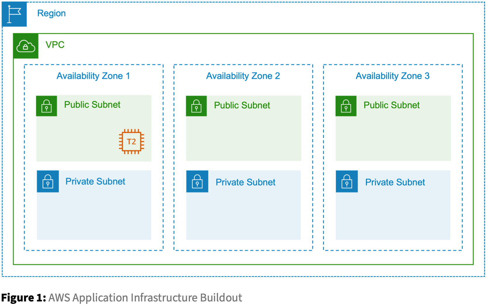

## Lab: Hashicorp Configuration Language

Terraform is written in HCL (HashiCorp Configuration Language) and is designed to be both human and machine readable. HCL is built using code configuration blocks which typically follow the following syntax:

Terraform Code Configuration block types include:
- Terraform Settings Block
- Terraform Provider Block
- Terraform Resource Block
- Terraform Data Block
- Terraform Input Variables Block
- Terraform Local Variables Block
- Terraform Output Values Block 
- Terraform Modules Block

We will be utilizing Terraform Provider, Terraform Resource, Data and Input Variables Blocks in this lab. This course will go through each of these configuration blocks in more detail throughout the course.

- Task1: Connect to the Student Workstation
- Task2: Verify Terraform installation
- Task3: Update Terraform Configuration to include EC2 instance 
- Task4: Use the Terraform CLI to Get Help
- Task5: Apply your Configuration
- Task6: Verify EC2 Server  in AWS Management Console

